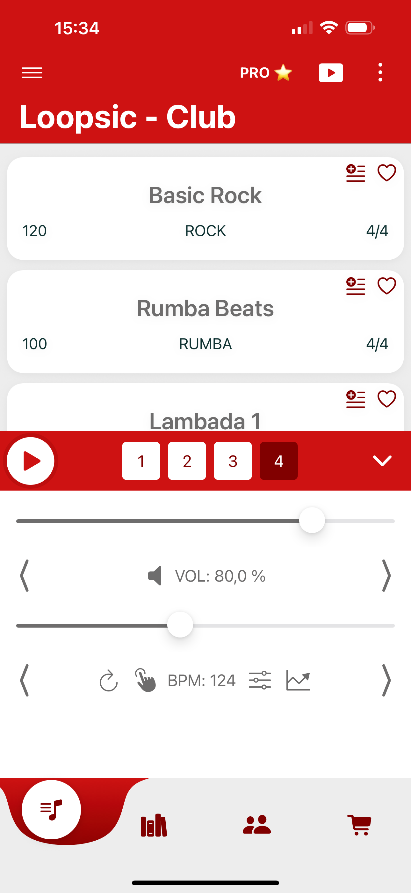
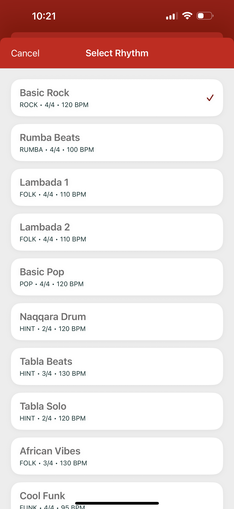
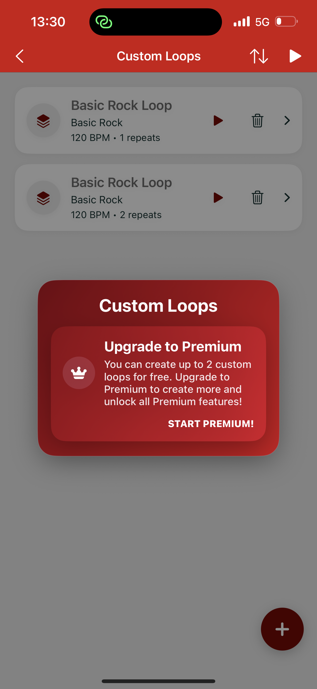
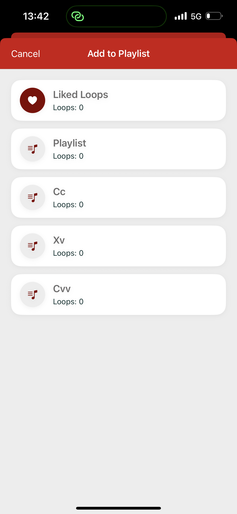
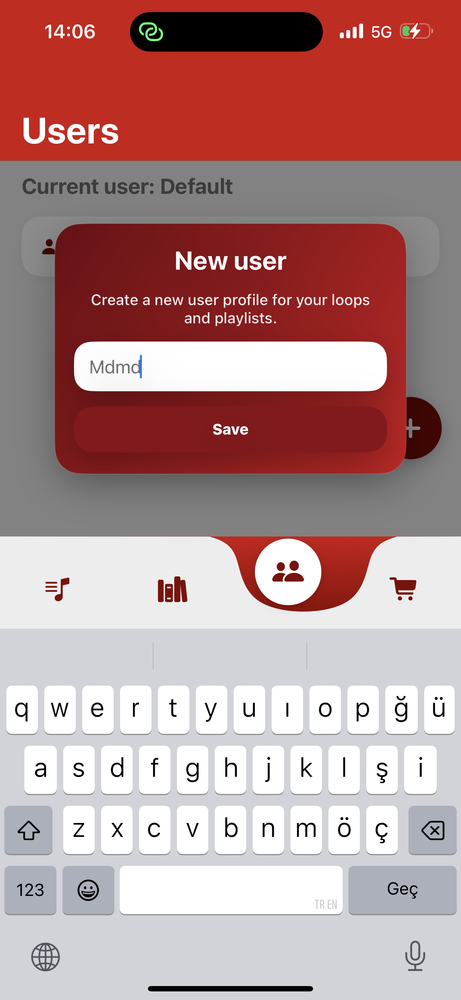

# Loopsic for iOS

A rhythm and loop companion for practicing, organizing, and playing percussion patterns.

## About

Loopsic for iOS is a practice companion built around the small decisions that make a rhythm useful: choose a pattern, set its tempo, repeat it, save it into a playlist, and return to it later. The shared SwiftUI layer and audio engine support that flow across playback, custom loops, shop access, background activity, and localization.

## Screenshots

  
  
  
  
  
  

## Highlights

- Percussion and rhythm pattern browsing
- Loop playback with BPM control and repeat mode
- Custom loops and playlist management
- Saved tempo and practice-oriented playback state
- Premium rhythm packs and shop flow
- Shared views, view models, services, and models
- Background playback and Live Activity support
- Localized App Store metadata
- Google Mobile Ads and Firebase messaging/analytics integrations

## Architecture

~~~mermaid
flowchart TD
    VIEW[SwiftUI views] --> VM[Shared view models]
    VM --> MODEL[Rhythm and playlist models]
    VM --> SERVICE[Playback and application services]
    SERVICE --> ENGINE[Shared audio engine]
    ENGINE --> LOOP[Loop playback and repeat]
    VM --> STORE[Shop and premium state]
    STORE --> ADS[Ads and app services]
    APP[App and Live Activity] --> SERVICE
    RELEASE[Fastlane metadata] --> ASC[App Store Connect]
~~~

The shared application layer is organized around SwiftUI views, view models, models, helpers, and services. Audio behavior is isolated behind the shared audio engine, while app-level state coordinates playback, playlists, shop access, background activity, and localized presentation.

## Technology

| Area | Implementation |
| --- | --- |
| UI | SwiftUI |
| State structure | Shared models, view models, services, and helpers |
| Audio | Shared audio engine for rhythm and loop playback |
| App integration | Background playback and Live Activity support |
| Platform services | Firebase Core, Firebase Messaging, and Google Mobile Ads SDK |
| Delivery | Xcode workspace/project and Fastlane |
| Targets | iOS 15+ target; macOS target also exists in the private workspace |
| Localization | Multiple localized resource bundles |

## Repository scope

Only showcase documentation and product screenshots are public here. No production Swift source, Firebase configuration, signing certificates, provisioning profiles, API keys, App Store Connect credentials, or private production media are included.
